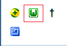
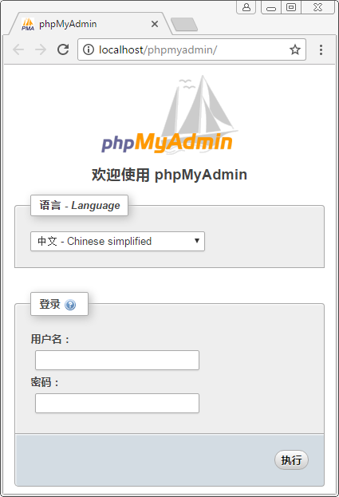
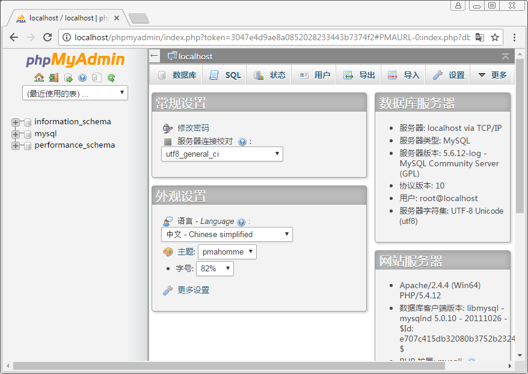
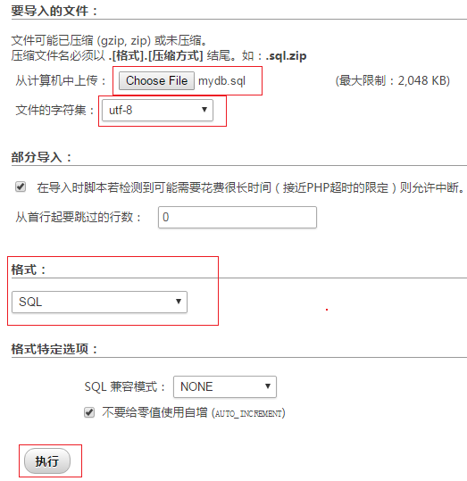
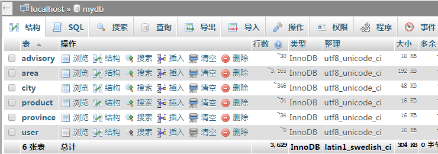
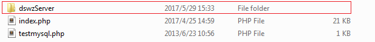

# 简易版电商网站
> ImoocDSWZ是一个简易版的电商网站，整个网站由网站首页、商品分类页、注册页、登录页、商品信息展示页、商品筛选页、购物车及结算页组成，整个网站包含了将网页添加到收藏夹、关键字搜索、图片轮播、商品分类菜单切换、商品筛选、商品简介、商品咨询、省市区三级联动、放大镜、注册、登录等功能。

## 项目的一些链接

**网站地址：[http://dswz.sc2yun.com/dswzClient/](http://dswz.sc2yun.com/dswzClient/)**

**网站的视频演示地址：[http://oqdvwkahb.bkt.clouddn.com/video.mp4](http://oqdvwkahb.bkt.clouddn.com/video.mp4)**

## 用到的技术
- **前台：** jQuery Ajax HTML5 CSS3 LocalStorage
- **构建工具：** Gulp
- **后台：** PHP
- **数据库：** MySQL

## 项目简介
**项目描述：** 整个项目的文件由dswzClient、dswzServer、sql三个文件夹组成，其中dswzClient存放网站的前端代码、dswzServer中存放的是网站的后台代码，sql中存放的是网站的数据库文件

**dswzClient的目录结构**

	├── .gitignore                // 设置上传到GitHub上时忽略上传的文件
	├── gulpfile.js               // Gulp编译脚本
	├── package.json              // 项目配置文件
	├── src                       // 生产目录
	    ├── css/                  // 存放网站的CSS样式
	    ├── fonts/                // 存放网站的字体
	    ├── images/               // 存放网站的图片
	    ├── js/                   // 存放网站的JS脚本
	    ├── lib/                  // 存放引用的第三方库
	    ├── classification.html   // 商品分类页的HTML
	    ├── index.html            // 网站首页的HTML
	    ├── login.html            // 登录页的HTML
	    ├── proinfo.html          // 商品信息展示页的HTML
	    ├── register.html         // 注册页的HTML
	    ├── select.html           // 商品筛选页的HTML
	    └── shopcar.html          // 购物车和结算页的HTML
            
## 启动项目

**第一步：克隆项目**  

	git clone https://github.com/meishadevs/ImoocDSWZ.git  

**第二步：进入存放网站文件的目录下**  

	cd dswzClient

**第三步：安装项目的依赖包**  

	npm install

**第四步：执行Gulp任务，编译项目**  

	gulp defaultTask

执行完`gulp defaultTask`任务后，会在dswzClient目录下自动创建一个dist文件夹，dist文件夹下存放的是编译后生成的文件

**第五步：执行Gulp任务，运行项目**  

	gulp server

执行	`gulp server`任务后会自动使用默认浏览器打开网页，当修改了src文件夹下的文件后，会立即编译，并且将编译生成的文件存在在dist目录下，网页也会src目录下的修改做出相应的改变

## 配置网站的服务器
> 整个网站的服务器使用的是PHP，数据库使用的是MySQL，服务器端我使用的是一个叫WampServer的软件，因为WampServer中同时集成了PHP和MySQL，下面的介绍的操作步骤也是使用WampServer

**第一步：安装WampServer**  
首先从网上下载一个WampServer软件，然后根据平时安装软件的方式直接点下一步下一步安装，安装过程中根据要求输入相应的信息，当启动WampServer出现下图所示的绿色图标表示WampServer安装成功，并且运行成功  

**第二步：启动phpMyAdmin**  
WampServer中使用phpMyAdmin管理MySQL数据库，单击上一步操作中出现的绿色的图标，在弹出的列表项中选择phpMyAdmin,点击phpMyAdmin后会使用默认浏览器打开如下图所示的phpMyAdmin登录界面  

**第三步：进入phpMyAdmin**
在用户名一栏中输入默认的用户名root，然后点击执行就可进入phpMyAdmin

**第四步：将网站需要用到的数据导入数据库中**  
选择导入，然后会弹出下图所示的界面，单击界面上的Choose File按钮，选择导入的文件为sql文件夹下的mydb.sql，将文件字符集设置为utf-8，格式选为SQL，设置完成后点击执行

**第五步：执行后的效果**  
此时可以看到，在MySQL数据库中创建了一个mydb数据库，mydb数据库下又创建了几张表

**第六步：部署服务器端代码**  
关闭phpMyAdmin，回到第一步的操作，再次点击绿色的小图标，在弹出的列表项中选择www directory，将dswzServer文件夹拷贝到打开的目录下，此时一个电商网站的后台就部署完成了，可以正常的使用网站中的注册、登录、省市区三级联动、商品翻页等功能  

## 特别说明
当你的服务器地址和我设置的服务器端地址不同时，可以修改**ImoocDSWZ\dswzClient\src\js**下的config.js文件

	/**
	 * Created by Administrator on 2017/4/10.
	 * 用于处理一些网站的配置信息
	 */

	//存放一些网站的配置信息
	var config = {

    //获得省、市、区数据的url
    'addressUrl': 'http://localhost/dswzServer/place.php',

    //获得商品咨询信息的url
    'advisoryUrl': 'http://localhost/dswzServer/advisory.php',

    //获得商品信息的url
    'productUrl': 'http://localhost/dswzServer/product.php',

    //淘宝搜索的url
    'taobaoUrl': 'https://suggest.taobao.com/sug',

    //百度搜索的url
    'baiduUrl': 'http://www.baidu.com/s',

    //注册账号的url
    'registerUrl': 'http://localhost/dswzServer/register.php',

    //登录账号的url
    'loginUrl': 'http://localhost/dswzServer/login.php',

    //每页的第1条商品咨询信息的下标
    'advisoryStartIndex' : 0,

    //每页展示商品咨询信息的条数
    'advisoryAmount' : 5,

    //每页第一条商品信息的下标
    'productStartIndex': 0,

    //每页展示的商品信息的条数
    'productAmount': 6
	};

修改完成后再在命令行中执行一次`gulp defaultTask`命令，会重新编译打包，或者执行`gulp server`命令，当src文件夹下有文件改变的时候，会自动编译打包到dist文件夹下

当你的数据库的设置和我的默认设置不同的时候，可以修改**ImoocDSWZ\dswzServer下的connect.php文件

	<?php
	//主机名
	$host = "localhost";
	//用户名
	$db_user = "root";
	//密码
	$db_pass = "";
	//数据库名 
	$db_name = "mydb";
	//时区 
	$timezone = "Asia/Shanghai";
	//链接数据库 
	$link = mysql_connect($host,$db_user,$db_pass);
	//选择数据库
	mysql_select_db($db_name, $link);
	//执行一条数据库查询语句
	mysql_query("SET names UTF8");
	header("Content-Type: text/html; charset=utf-8");
	//设置时区 
	date_default_timezone_set($timezone);
	?>

